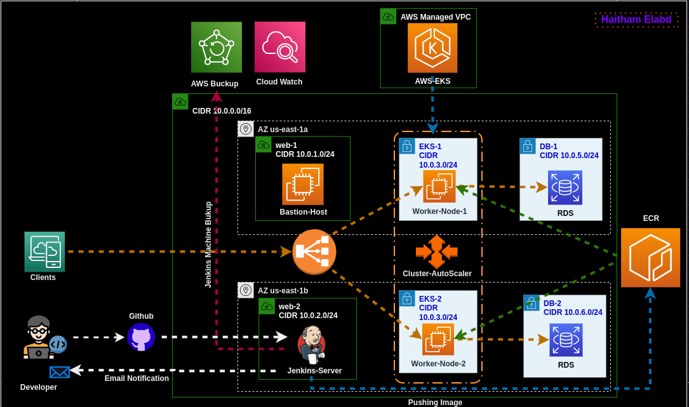

## Table of Contents

1. [Project Architecture](#project-architecture)
2. [Introduction](#introduction)
3. [Project Features](#project-features)
4. [Infrastructure Overview](#infrastructure-overview)
5. [Ansible Playbooks](#ansible-playbooks)
6. [Jenkins CI/CD Pipelines](#jenkins-cicd-pipelines)
7. [Kubrenetes Files](#kubernetes-files)
8. [Docker Compose](#docker-compose)
9. [Working with the Project](#working-with-the-project)

## 1. Project Architecture <a name="project-architecture"></a>

## 2. Introduction <a name="introduction"></a>
This project is the final project for the DevOps and Automation track at the National Telecommunication Institute [NTI](https://www.nti.sci.eg/), under the supervision of the Ministry of Communications and Information Technology, Which aims to apply the knowledge, tools, and practices learned during the initiative. This project focuses on deploying a Django application on an Amazon Elastic Kubernetes Service (EKS) cluster using Terraform for infrastructure management.I customized the Jenkins pipeline to automate the building and deployment processes of the project. Additionally, it's configured to send notifications to developer, providing updates on the pipeline's state.

## 3. Project Features <a name="project-features"></a>
* **End-to-end automation** is key in ensuring smooth software delivery from development to deployment. By automating tasks like building, testing, and deploying code, updates are delivered quickly and consistently with little manual effort

* **Infrastructure as Code (IaC)** principles are employed to manage and provision infrastructure resources efficiently and effectively. I use terraform to achive this. 
* **Continuous Integration and Continuous Delivery (CI/CD)** practices are integral components of my project, enabling early detection of issues. CD automates the deployment process, facilitating frequent and reliable releases of software updates to production environments.


## 4. Infrastructure Overview <a name="infrastructure-overview"></a>
In building Project infrastructure, I adopt a modular approach to ensure scalability, flexibility, and ease of management. Each module serves a specific function and contributes to the overall architecture of our system.

#### VPC Module

The Virtual Private Cloud (VPC) module establishes a virtual network environment in the AWS cloud, providing isolated resources. Additionally, an internet gateway is created within the VPC module to enable communication between the VPC and the internet, allowing for seamless access to external resources.

#### Subnets Module
 I have established six subnets: two public subnets for hosting Jenkins and a bastion host, two private subnets for the Elastic Kubernetes Service (EKS), and two private subnets for Amazon RDS instances. 

#### srv Module

 Within this module, I have created two instances: one for Jenkins and another for the bastion host. Additionally, a local file resource has been configured to generate the inventory file, facilitating seamless management and configuration of our infrastructure components.
#### Database Module
In This module I use MySQL RDS instances to securely store and manage application data.

#### ECR Module

The Elastic Container Registry module creates repositories for storing Docker images, facilitating efficient distribution and deployment of containerized applications.

#### EKS Module
IN This Module I provisioned EKS Additionally, a node group with auto-scaling capabilities is created within this module. All necessary roles required for the EKS cluster to operate seamlessly are also assigned, optimizing the performance and reliability of the cluster.

#### Backup Module

This module craete cron job to take a backup of the Jenkins server every workday, with the following schedule: cron(0 5 ? * SUN-THU *). This ensures that regular backups are taken during weekdays.
## 5. Ansible Playbooks <a name="ansible-playbooks"></a>
In this section, I use Ansible playbooks to automate the installation and configuration of Jenkins and Cloud Watch agent. 
* **Jenkins Installation Playbook** This playbook  is responsible for installing and configuring Jenkins on the designated EC2 instance. It automates the setup process, ensuring that Jenkins is provisioned with configurations to facilitate continuous integration and deployment workflows.
* **CloudWatch Agent Installation Playbook** This playbook automates the installation and configuration of the CloudWatch agent on Jenkins and bastion host. It enables the monitoring of system metrics and log files, providing valuable insights into the health and performance of our environment.
## 6. Jenkins CI/CD Pipelines <a name="jenkins-cicd-pipelines"></a>
I create jenkins pipeline with the following stages 
1. **Build Dockerfile**:
   - This step prepares our application by configuring database credentials and building the Docker image.
   - It ensures that the necessary credentials are securely embedded within the application.

2. **Get Repository URI**:
   - This step retrieves the URI of the Amazon ECR repository where the Docker image will be stored.
   - It prepares for the authentication and pushing of the Docker image to the repository.

3. **Authenticate with AWS ECR**:
   - This step authenticates Jenkins with AWS ECR using the retrieved repository URI.
   - It enables Jenkins to push the Docker image to the repository securely.

4. **Tag and Push Image to ECR**:
   - This step tags the Docker image with the build number and pushes it to the specified repository in AWS ECR.
   - It ensures that the latest version of the application is stored in the repository for deployment.

5. **Deploy to Kubernetes**:
   - This step updates the Kubernetes deployment YAML file with the latest image tag.
   - It authenticates Jenkins with the Amazon EKS cluster and applies the updated deployment and service configurations.
   - It ensures that the latest version of the application is deployed and accessible within the Kubernetes cluster.

6. **Post-build Actions (Email Notification)**:
   - This step sends an email notification to the developer with vital information about the pipeline's execution.
   - It provides visibility into the pipeline's status, build number, and execution time, allowing for effective monitoring and communication.

## 7. Kubernetes Files  <a name="kubernetes-files"></a>
The `deployment.yaml` file specifies how many instances of the Django application should be running and how they should be updated. It ensures that the specified number of replicas of the Django application are always available to handle incoming requests. This file defines key features such as the number of replicas, the Docker image to use for the application. 

The `service.yaml` file defines how the Django application can be accessed from outside the Kubernetes cluster. It configures the service to expose the Django application to external traffic, providing load balancing functionality to distribute incoming requests among the running pods. Key features of this file include specifying the type of service (LoadBalancer), the ports to expose, and label selectors for routing traffic to the correct pods.

## 8. Docker Compose <a name="docker-compose"></a>

1. **nginx Service**
 This service builds the nginx container using the Dockerfile located in the ./nginx directory. It exposes port 80 for HTTP traffic and depends on the django_app service.

2. **django_app Service** This service uses the django_app image and builds the container using the Dockerfile located in the ./django directory. It exposes port 8001 for Django application traffic and runs the Gunicorn server to serve the Django application. It depends on the db service and loads environment variables from the .env file located in the ./django directory.

3. **db Service** In this services I use the mysql image to run the MySQL database container. It sets the root password and defines the database name. It mounts a volume to persist the database data in the ./data/mysql/db directory.

## 9. Working with the Project <a name="working-with-the-project"></a>
**NOTE** that this project is not free and will incur costs.To utilize this project for your own purposes, follow these steps:

1. **Clone the Repository**: Begin by cloning the project repository to your local machine using the following command:

    ```
    git clone https://github.com/h3itham/NTI-Final-Project-DevOps-Automation
    ```

2. **Create `terraform.tfvars` File**: Create a `terraform.tfvars` file in the root directory of the Terraform folder. This file should contain configuration variables specific to your environment. You can use the provided sample file or modify it according to your needs. Additionally, **ensure** you configure your remote backend or delete the existing one to work with a local Terraform state file.

3. **Validate Terraform Configuration**: Before applying changes to your infrastructure, it's recommended to validate the Terraform configuration to ensure correctness:

    ```
    terraform validate
    ```

4. **Apply Terraform Changes**: Please note that this step may take approximately 20 to 25 minutes to complete:

    ```
    terraform apply
    ```

5. **Generate Ansible Inventory File**: After successfully provisioning the infrastructure, a generated inventory file will be available in the `ansible` folder. This file contains all machines IPs.

6. **Install and Configure Jenkins Machine**: 

    ```
    ansible-playbook jenkinsMachine.yaml
    ```

7. **Install CloudWatch Agent**: 

    ```
    ansible-playbook cloudwatchAgent.yaml
    ```

8. **Configure Jenkins and Install Plugins**: Manually configure Jenkins by accessing the Jenkins dashboard through your web browser. Install required plugins (Build Timestamp, Email Extension Template) and configure email section.
9. **Create and Run Multibranch Pipeline**: Create a multibranch pipeline in Jenkins and configure it to pull source code from your repository. Run the pipeline to trigger the build, test, and deployment processes defined in your Jenkins pipeline.


